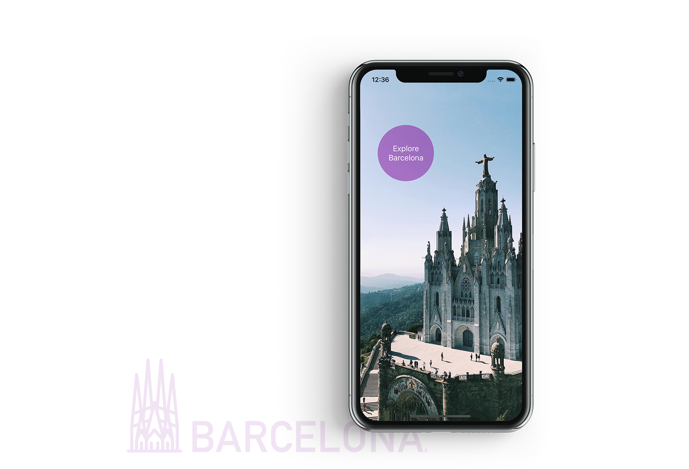
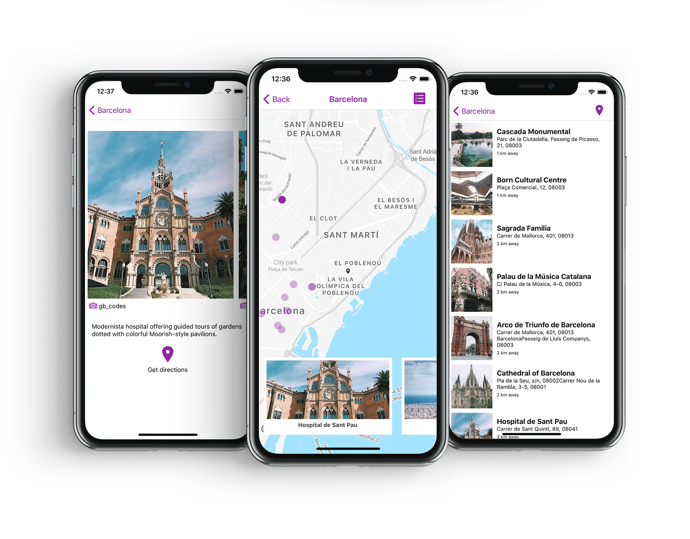

# **Explore Barcelona**



<hr/>

## Overview

**Explore Barcelona** app allows you to locate the city's main 'must-see' attractions as well as the less touristy places.

You can switch between the map and list views to see the closest places to visit.



## Application Setup

1. Clone the repo to your local machine

``` 
git clone https://github.com/gelenab/explore-barcelona
```
2. Install all dependencies
```
npm i
```
3. Start the app through expo

```
npm start ios
```

## Tech Stack

React Native &
Firebase

## Developers

* Gelena Barker | <a href="https://www.linkedin.com/in/gelena-barker-760b015a//">linkedIn</a> | <a href="https://github.com/GelenaB/">gitHub</a>